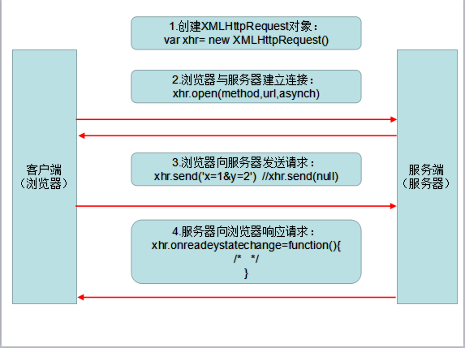

## ajax 详解

### 客户端向服务端发送 ajax 请求的简单过程



### 1.创建 XMLHttpRequest 对象

    - 非ie内核
    ```
    var xhr= new XMLHttpRequest()
    ```
    - ie内核早期ie版本写法
    ```
    var xhr=new Microsoft.XMLHTTP()
    ```

### 2.浏览器与服务器建立连接

    - open方法：type：请求类型get post put delete
                url:请求地址
                async:同步为false,异步为true
    ```
    xhr.open(type,url,async)
    ```

### 3.浏览器向服务器发送请求

    - send方法：get请求send(null)
    ```
    xhr.send('x=1&y=2')
    ```

### 4.服务器向浏览器响应请求

    - onreadystatechage:服务器向浏览器响应的回调函数
    ```
    xhr.onreadystatechange=function(){
        <!-- 代码 -->
    }
    ```
    - readyState:表示ajax请求的当前状态：
        0：代表未初始化，还没有调用open方法
        1：代表正在加载，open方法已被调用，但send方法还没有被调用
        2：代表已加载完毕。send 已被调用，请求已经开始
        3：代表交互中，服务器正在发送响应
        4：代表完成，响应发送完毕
    ```
    xhr.onreadystatechange=function(){
        if(xhr.readyState === 4){
            <!-- 浏览器响应完毕后该做的事 -->
        }
    }
    ```
    - abort:取消ajax请求
    ```
    xhr.onreadystatechange=function(){
        if(xhr.readyState === 3){
            xhr.abort()
        }
    }
    ```
    - status：表示服务端目前的状态
        404 没有找到页面（not found）
        403 禁止访问（forbidden）
        500 内部服务器出错（internal service error）
        200 一切正常（ok）
        304 没有被修改（not modified）(服务器返回304状态，表示源文件没有被修改)
    ```
    xhr.onreadystatechange=function(){
        if(xhr.readyState === 4){
            if(xhr.status === 200){
                <!-- 服务器正常浏览器响应完毕 -->
            }
        }
    }
    ```
