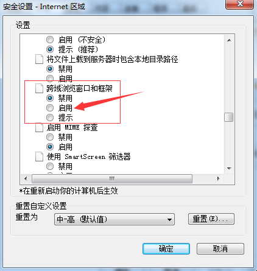
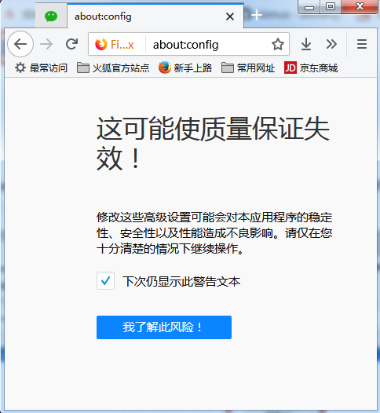
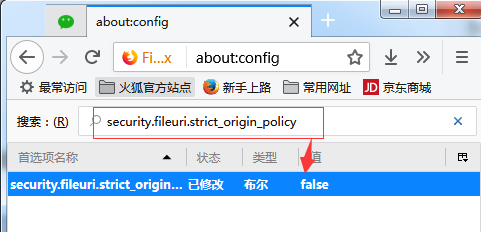
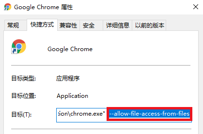

[点击跨域页面](./eg/index.html)

* 当浏览器降级了可以访问器页面

### ie 浏览器：

* 安全设置中将跨域浏览窗口和框架选择启用

  

### 火狐浏览器：

* 1.地址栏中输入 about:config,然后单击“我了解此风险”

* 2.找到 security.fileuri.strict_origin_policy,然后在值下面的 true 右键单击，选择切换，修改其参数：true 改为 false

* 3.重启浏览器

### 谷歌中加入：

#### 方法一

* 谷歌浏览器快捷方式中，属性-目标-在'C:\Program Files(x86)\Google\Chrome\Application\chrome.exe'后面加 --allow-file-access-from-files。然后先点击“应用按钮”，再点击“确定按钮”，重启谷歌浏览器，跨域问题解决！

#### 方法二（新版谷歌浏览器）

* --user- data- dir=C:\MyChromeDevUserData

* c 盘中建立文件夹：MyChromeDevUserData

