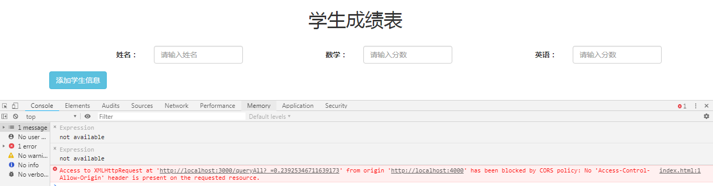
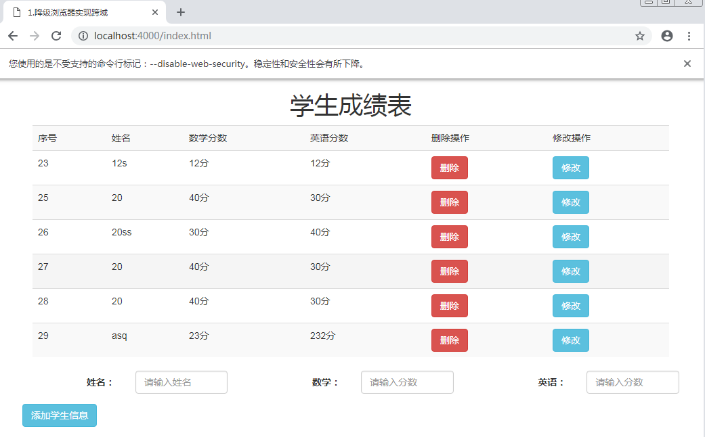

# 降级浏览器实现跨域

## 原理：将浏览器的安全拦截功能撤掉，可以实现跨域访问数据

### 非常适合前端开发时使用，尤其是上线后前后端不存在跨域，只是开发时存在跨域

## 1.ie 浏览器降级浏览器教程：

### 1. 安全设置中将跨域浏览窗口和框架选择启用

## 2.火狐浏览器降级浏览器教程：

### 1.地址栏中输入 about:config,然后单击“我了解此风险”

### 2.找到 security.fileuri.strict_origin_policy,然后在值下面的 true 右键单击，选择切换，修改其参数：true 改为 false

### 3.重启浏览器

## 3.谷歌浏览器降级浏览器教程：

### 方法一

* 红框处加 --allow-file-access-from-files

### 方法二（新版谷歌浏览器）

* --user- data- dir=C:\MyChromeDevUserData

* c 盘中建立文件夹：MyChromeDevUserData

- 然后先点击“应用按钮”，再点击“确定按钮”，重启谷歌浏览器！

### 谷歌浏览器降级成功

## 4.小案例（mysql+node+js 实现一个跨域页面）

[点击跨域页面](./eg/index.html)

### 1.启动 mysql

### 2.启动后台服务 server.js

### 3.启动静态服务器 static.js

### 4.打开http://localhost:4000/index.html

* 错误提示信息
  

- 浏览器降级访问正常
  
