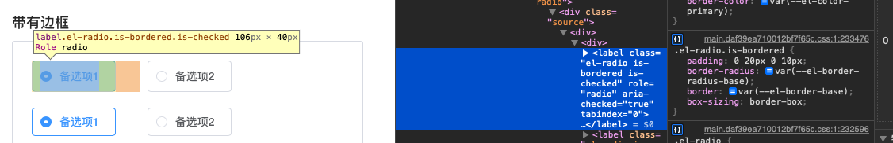

# 一.Radio

- 组件介绍[Radio 单选框](https://element-plus.gitee.io/zh-CN/component/radio.html)

## index.ts

```js
import Radio from './src/radio.vue'
import RadioButton from './src/radio-button.vue'
import RadioGroup from './src/radio-group.vue'

import type { App } from 'vue'
import type { SFCWithInstall } from '@element-plus/utils/types'

Radio.install = (app: App): void => {
 app.component(Radio.name, Radio)
 app.component(RadioButton.name, RadioButton)
 app.component(RadioGroup.name, RadioGroup)
}

Radio.RadioButton = RadioButton
Radio.RadioGroup = RadioGroup

const _Radio = Radio as any as SFCWithInstall<typeof Radio> & {
 RadioButton: typeof RadioButton
 RadioGroup: typeof RadioGroup
}

export default _Radio
export const ElRadio = _Radio
export const ElRadioGroup = RadioGroup
export const ElRadioButton = RadioButton

export * from './src/token'
```

### radio.vue


::: tip 主要思路

从图中可以看出，radio 组件使用的流程

- 主线上通过 vue 将本组件注册到 vue 中
- 用户使用本组件，进行相关属性传递及事件操作
- 源码内部对，用户传递的属性/事件进行处理

:::

- Radio Attributes
  - model-value / v-model：属性传递，动态修改
  - label：属性传递，作为本组件的一个标识与其他字段进行比较
  - disabled:属性传递，通过样式控制
  - border:属性传递，通过样式控制
    > 
  - size:属性传递计算后，通过样式控制
  - name:属性传递
- Radio Events
  - change：数据发生变化内部向外部发送最新数据

::: details 简化后的代码

```vue
<template>
  <label
    class="el-radio"
    :class="{
      [`el-radio--${radioSize || ''}`]: radioSize,
      'is-disabled': isDisabled,
      'is-focus': focus,
      'is-bordered': border,
      'is-checked': model === label,
    }"
    role="radio"
    @keydown.space.stop.prevent="model = isDisabled ? model : label"
  >
    <span
      class="el-radio__input"
      :class="{
        'is-disabled': isDisabled,
        'is-checked': model === label,
      }"
    >
      <span class="el-radio__inner"></span>
      <input
        ref="radioRef"
        v-model="model"
        class="el-radio__original"
        :value="label"
        type="radio"
        aria-hidden="true"
        :name="name"
        :disabled="isDisabled"
        tabindex="-1"
        @focus="focus = true"
        @blur="focus = false"
        @change="handleChange"
      />
    </span>
    <span class="el-radio__label" @keydown.stop>
      <slot>
        {{ label }}
      </slot>
    </span>
  </label>
</template>

<script lang="ts">
import { defineComponent, computed, nextTick, ref } from 'vue'
import { UPDATE_MODEL_EVENT } from '@element-plus/utils/constants'
import { isValidComponentSize } from '@element-plus/utils/validators'
import { useRadio, useRadioAttrs } from './useRadio'

import type { PropType } from 'vue'
import type { ComponentSize } from '@element-plus/utils/types'

export default defineComponent({
 name: 'ElRadio',
 componentName: 'ElRadio',
 props: {
   modelValue: {},
   label: {},
   disabled: Boolean,
   name: {},
   border: Boolean,
   size: {},
 },
 setup(props, ctx) {
   const { isGroup, radioGroup, elFormItemSize, ELEMENT, focus, elForm } =
     useRadio()

   const radioRef = ref<HTMLInputElement>()
   const model = computed<string | number | boolean>({
     get() {
       return isGroup.value ? radioGroup.modelValue : props.modelValue
     },
     set(val) {
       if (isGroup.value) {
         radioGroup.changeEvent(val)
       } else {
         ctx.emit(UPDATE_MODEL_EVENT, val)
       }
       radioRef.value.checked = props.modelValue === props.label
     },
   })

   const { tabIndex, isDisabled } = useRadioAttrs(props, {
     isGroup,
     radioGroup,
     elForm,
     model,
   })

   const radioSize = computed(() => {
     const temRadioSize = props.size || elFormItemSize.value || ELEMENT.size
     return isGroup.value
       ? radioGroup.radioGroupSize || temRadioSize
       : temRadioSize
   })

   function handleChange() {
     nextTick(() => {
       ctx.emit('change', model.value)
     })
   }

   return {
     focus,
     isGroup,
     isDisabled,
     model,
     tabIndex,
     radioSize,
     handleChange,
     radioRef,
   }
 },
})
</script>
```

:::
[源码查看](https://github.com/zhoubichuan/element-plus/blob/dev/packages/components/radio/src/radio.vue)

### radio-button.vue


::: tip 主要思路

从图中可以看出，radio 组件使用的流程

- radio-button 作为 radio-group 的插槽使用
- 源码内部对，用户传递的属性/事件进行处理

:::
Radio-button Attributes

- label
- disabled
- name

::: details 简化后的代码

```vue
<template>
  <label
    class="el-radio-button"
    :class="[
      size ? 'el-radio-button--' + size : '',
      {
        'is-active': value === label,
        'is-disabled': isDisabled,
        'is-focus': focus,
      },
    ]"
    role="radio"
    :aria-checked="value === label"
    :aria-disabled="isDisabled"
    :tabindex="tabIndex"
    @keydown.space.stop.prevent="value = isDisabled ? value : label"
  >
    <input
      ref="radioRef"
      v-model="value"
      class="el-radio-button__original-radio"
      :value="label"
      type="radio"
      :name="name"
      :disabled="isDisabled"
      tabindex="-1"
      @focus="focus = true"
      @blur="focus = false"
    />
    <span
      class="el-radio-button__inner"
      :style="value === label ? activeStyle : null"
      @keydown.stop
    >
      <slot>
        {{ label }}
      </slot>
    </span>
  </label>
</template>
<script lang="ts">
import { computed, defineComponent, ref } from "vue"
import { useRadio, useRadioAttrs } from "./useRadio"

export default defineComponent({
  name: "ElRadioButton",

  props: {
    label: {
      type: [String, Number, Boolean],
      default: "",
    },
    disabled: Boolean,
    name: {
      type: String,
      default: "",
    },
  },
  setup(props) {
    const {
      isGroup,
      radioGroup,
      elFormItemSize,
      ELEMENT,
      focus,
      elForm,
    } = useRadio()

    const size = computed(() => {
      return radioGroup.radioGroupSize || elFormItemSize.value || ELEMENT.size
    })

    const radioRef = ref<HTMLInputElement>()

    const value = computed<boolean | string | number>({
      get() {
        return radioGroup.modelValue
      },
      set(value) {
        radioGroup.changeEvent(value)

        radioRef.value.checked = radioGroup.modelValue === props.label
      },
    })

    const { isDisabled, tabIndex } = useRadioAttrs(props, {
      model: value,
      elForm,
      radioGroup,
      isGroup,
    })

    const activeStyle = computed(() => {
      return {
        backgroundColor: radioGroup.fill || "",
        borderColor: radioGroup.fill || "",
        boxShadow: radioGroup.fill ? `-1px 0 0 0 ${radioGroup.fill}` : "",
        color: radioGroup.textColor || "",
      }
    })

    return {
      isGroup,
      size,
      isDisabled,
      tabIndex,
      value,
      focus,
      activeStyle,
      radioRef,
    }
  },
})
</script>
```

:::

[源码查看](https://github.com/zhoubichuan/element-plus/blob/dev/packages/components/radio/src/radio-button.vue)

### radio-group.vue

Radio-group Attributes

- model-value / v-model
- size
- disabled
- text-color
- fill

Radio-group Events

- change

::: details 简化后的代码

```vue
<template>
  <div
    ref="radioGroup"
    class="el-radio-group"
    role="radiogroup"
    @keydown="handleKeydown"
  >
    <slot></slot>
  </div>
</template>

<script lang="ts">
import {
  defineComponent,
  nextTick,
  computed,
  provide,
  onMounted,
  inject,
  ref,
  reactive,
  toRefs,
  watch,
} from 'vue'
import { EVENT_CODE } from '@element-plus/utils/aria'
import { UPDATE_MODEL_EVENT } from '@element-plus/utils/constants'
import { isValidComponentSize } from '@element-plus/utils/validators'
import { elFormItemKey } from '@element-plus/tokens'
import radioGroupKey from './token'

import type { PropType } from 'vue'
import type { ElFormItemContext } from '@element-plus/tokens'
import type { ComponentSize } from '@element-plus/utils/types'

export default defineComponent({
  name: 'ElRadioGroup',

  componentName: 'ElRadioGroup',

  props: {
    modelValue: {
      type: [String, Number, Boolean],
      default: '',
    },
    size: {
      type: String as PropType<ComponentSize>,
      validator: isValidComponentSize,
    },
    fill: {
      type: String,
      default: '',
    },
    textColor: {
      type: String,
      default: '',
    },
    disabled: Boolean,
  },

  emits: [UPDATE_MODEL_EVENT, 'change'],

  setup(props, ctx) {
    const radioGroup = ref(null)

    const elFormItem = inject(elFormItemKey, {} as ElFormItemContext)

    const radioGroupSize = computed<ComponentSize>(() => {
      return props.size || elFormItem.size
    })

    // methods
    const changeEvent = (value) => {
      ctx.emit(UPDATE_MODEL_EVENT, value)
      nextTick(() => {
        ctx.emit('change', value)
      })
    }

    provide(
      radioGroupKey,
      reactive({
        name: 'ElRadioGroup',
        ...toRefs(props),
        radioGroupSize,
        changeEvent,
      } as any)
    )

    watch(
      () => props.modelValue,
      (val) => {
        elFormItem.formItemMitt?.emit('el.form.change', [val])
      }
    )

    const handleKeydown = (e) => {
      // 左右上下按键 可以在radio组内切换不同选项
      const target = e.target
      const className =
        target.nodeName === 'INPUT' ? '[type=radio]' : '[role=radio]'
      const radios = radioGroup.value.querySelectorAll(className)
      const length = radios.length
      const index = Array.from(radios).indexOf(target)
      const roleRadios = radioGroup.value.querySelectorAll('[role=radio]')
      let nextIndex = null
      switch (e.code) {
        case EVENT_CODE.left:
        case EVENT_CODE.up:
          e.stopPropagation()
          e.preventDefault()
          nextIndex = index === 0 ? length - 1 : index - 1
          break
        case EVENT_CODE.right:
        case EVENT_CODE.down:
          e.stopPropagation()
          e.preventDefault()
          nextIndex = index === length - 1 ? 0 : index + 1
          break
        default:
          break
      }
      if (nextIndex === null) return
      roleRadios[nextIndex].click()
      roleRadios[nextIndex].focus()
    }

    onMounted(() => {
      const radios = radioGroup.value.querySelectorAll('[type=radio]')
      const firstLabel = radios[0]
      if (
        !Array.from(radios).some((radio: HTMLInputElement) => radio.checked) &&
        firstLabel
      ) {
        firstLabel.tabIndex = 0
      }
    })
    return {
      handleKeydown,
      radioGroupSize,
      radioGroup,
    }
  },
})
</script>
```

:::

### useRadio.ts

```js
import { ref, computed, inject } from 'vue'
import { elFormKey, elFormItemKey } from '@element-plus/tokens'
import { useGlobalConfig } from '@element-plus/utils/util'
import radioGroupKey from './token'

import type { ComputedRef, WritableComputedRef } from 'vue'
import type { ElFormContext, ElFormItemContext } from '@element-plus/tokens'
import type { RadioGroupContext } from './token'

export const useRadio = () => {
  const ELEMENT = useGlobalConfig()
  const elForm = inject(elFormKey, {} as ElFormContext)
  const elFormItem = inject(elFormItemKey, {} as ElFormItemContext)
  const radioGroup = inject(radioGroupKey, {} as RadioGroupContext)
  const focus = ref(false)
  const isGroup = computed(() => radioGroup?.name === 'ElRadioGroup')
  const elFormItemSize = computed(() => elFormItem.size || ELEMENT.size)

  return {
    isGroup,
    focus,
    radioGroup,
    elForm,
    ELEMENT,
    elFormItemSize,
  }
}

interface IUseRadioAttrsProps {
  disabled?: boolean
  label: string | number | boolean
}

interface IUseRadioAttrsState {
  isGroup: ComputedRef<boolean>
  radioGroup: RadioGroupContext
  elForm: ElFormContext
  model: WritableComputedRef<string | number | boolean>
}

export const useRadioAttrs = (
  props: IUseRadioAttrsProps,
  { isGroup, radioGroup, elForm, model }: IUseRadioAttrsState
) => {
  const isDisabled = computed(() => {
    return isGroup.value
      ? radioGroup.disabled || props.disabled || elForm.disabled
      : props.disabled || elForm.disabled
  })

  const tabIndex = computed(() => {
    return isDisabled.value || (isGroup.value && model.value !== props.label)
      ? -1
      : 0
  })

  return {
    isDisabled,
    tabIndex,
  }
}
```

### token.ts

```js
import type { InjectionKey } from 'vue'
import type { ComponentSize } from '@element-plus/utils/types'

type IModelType = boolean | string | number

export interface RadioGroupContext {
  name: 'ElRadioGroup'
  modelValue: IModelType
  fill: string
  textColor: string
  disabled: boolean
  size: ComponentSize
  radioGroupSize: ComponentSize
  changeEvent: (val: IModelType) => void
}

const radioGroupKey: InjectionKey<RadioGroupContext> = 'RadioGroup' as any

export default radioGroupKey
```
